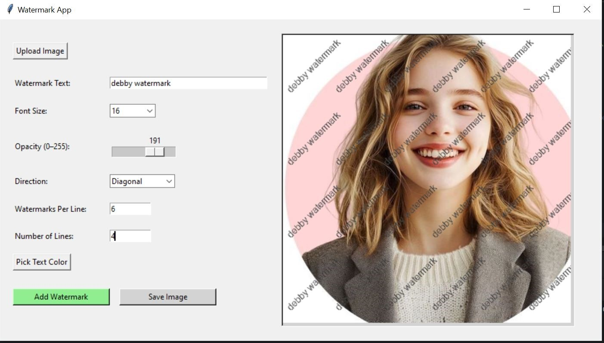

# Image Watermarking App

A desktop application built with Python and Tkinter that allows users to apply custom watermarks (text) on images. It supports diagonal and horizontal watermarks, and includes live preview while adjusting font, size, color, and direction.

Features:

- Add horizontal or diagonal watermark text
- Customize text size, color, and rotation angle
- Apply watermark across the full image
- Live preview before saving


## 📷 Preview




## 🛠️ Built With
- Python 3
- Tkinter (GUI)
- PIL (Pillow) for image processing

## 📦 Installation
1. Clone the repo:
```bash
https://github.com/olubamire/Image_Watermarking_App.git
